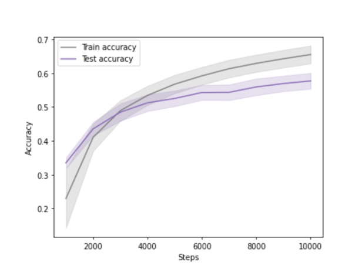
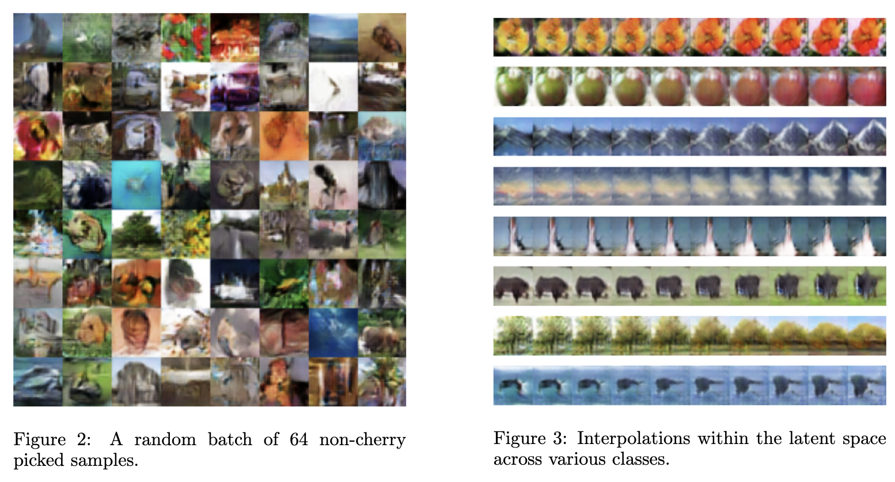

# Efficient CIFAR-100 Classification and Image Generation

This project adapts the Residual Network (ResNet) architecture with depthwise separable convolutions for efficient CIFAR-100 classification, achieving performance under 100,000 parameters and training in 10,000 steps. It also introduces a modified conditional Spectral Normalization GAN (SN-GAN) for image generation on CIFAR-100, optimized to run with less than 1,000,000 parameters.

## Key Features

- **Adapted ResNet Architecture**: Utilizes depthwise separable convolutions to enhance efficiency for CIFAR-100 classification tasks.
- **Modified SN-GAN for Image Generation**: Implements adaptive weighting in hinge loss calculations to improve performance.
- **Conditional Batch Normalization and Projection Discriminator**: Ensures stable training and targeted image synthesis.

## Overview

This project focuses on two main aspects:
1. **Efficient Classification**: A modified ResNet architecture that reduces computational complexity while maintaining high accuracy.
2. **Stable Image Generation**: A novel SN-GAN approach tailored for CIFAR-100, integrating advanced normalization techniques and a projection discriminator for more accurate and consistent results.

## Dataset

- **CIFAR-100**: Both the classification and image generation models are trained and evaluated on the CIFAR-100 dataset.

## Objectives

- Improve the efficiency of deep learning models for image classification tasks.
- Develop robust generative models capable of producing high-quality images with targeted characteristics.

## Methods

- **Depthwise Separable Convolutions**: Applied in the ResNet architecture to optimize computational cost.
- **Adaptive Weighting in Hinge Loss**: Enhances the GAN training process by dynamically adjusting loss contributions.
- **Conditional Batch Normalization**: Provides instance-specific scaling and shifting to stabilize GAN training.
- **Projection Discriminator**: Utilized in the SN-GAN to enforce more precise class-conditional image generation.

## Results

### Classifier Performance
The modified ResNet shows competitive performance on CIFAR-100 with reduced computational requirements. Upon completion, it achieved:
- **Training Accuracy**: 65.5% ± 2.6%
- **Test Accuracy**: 57.7% ± 2.3%

### Generator Performance
The adapted SN-GAN demonstrates stable and high-quality image generation capabilities. The results measured by the LPIPS (Learned Perceptual Image Patch Similarity) metric yielded a score of **0.23**.

## Future Work

- Explore further optimizations in the ResNet architecture.
- Investigate alternative loss functions and regularization techniques for GANs.

